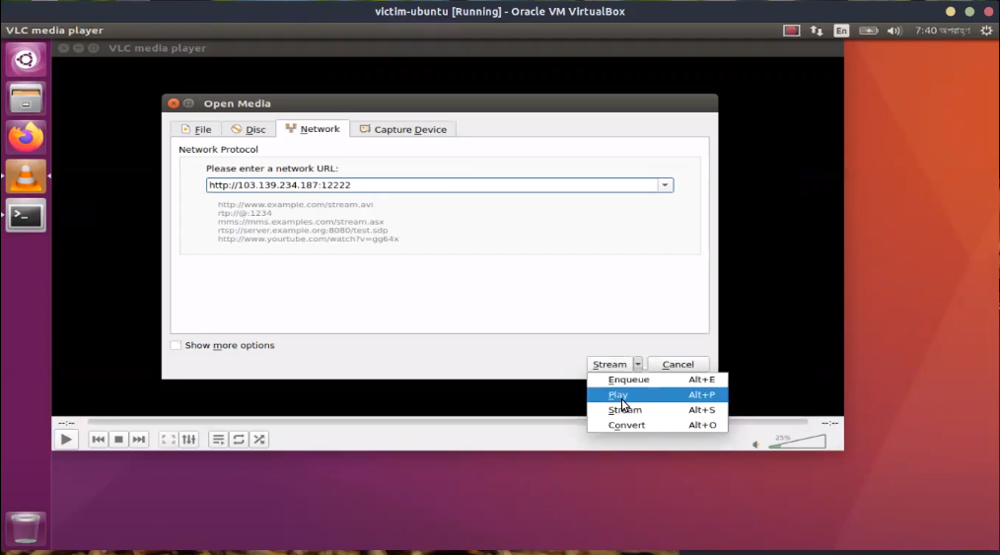
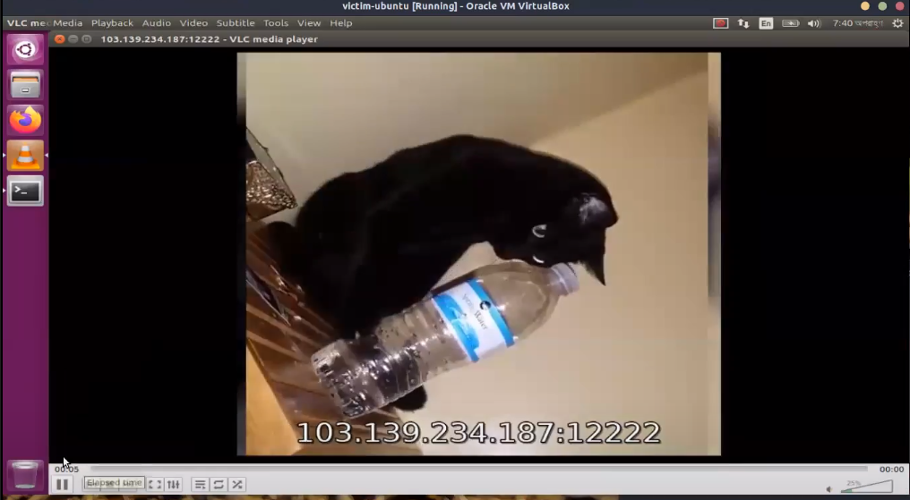
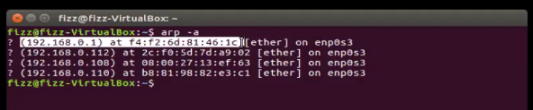
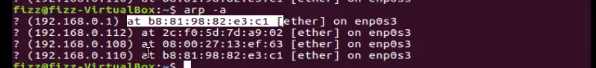
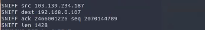
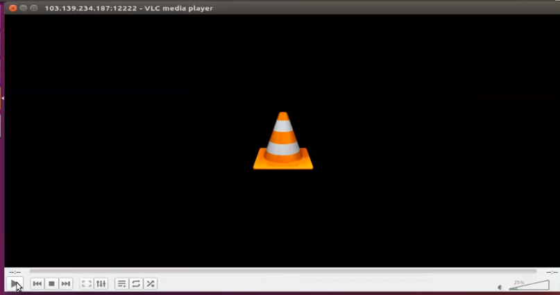
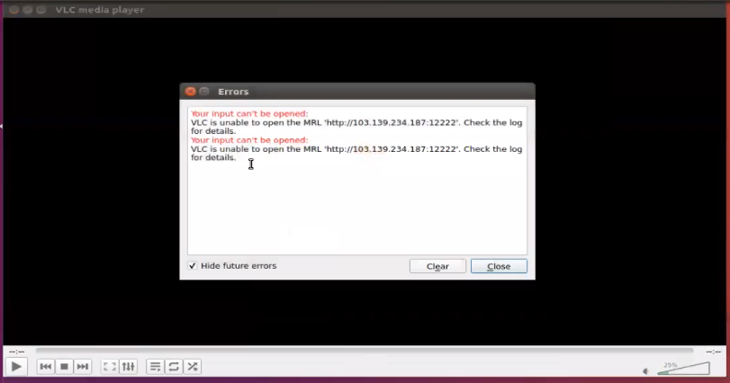

# TCP Reset Attack on Video Streaming

1. 	Steps of the Attack

## Pre-requisites:
The attacker needs to know the IP address of the gateway router.
Use the command `ip route show` to determine the gateway ip.
In our case, the gateway IP is 192.168.0.1

The attacker also needs the IP address of the victim. This is determined by the router using its DHCP protocol. If the attacker has access to the DHCP client list, it can determine the IP address of the victim. 
In our case, the victim's IP is 192.168.0.107. 
(DHCP client reservation can be used to ensure the victim device is always assigned the selected IP)

The attacker needs to turn on IP-forwarding. This ensures that the packets are forwarded to the victim even after ARP spoofing is performed to prevent any suspicion.
To turn on IP forwarding, edit the file `/etc/sysctl.conf`
	Add the following line:
`net.ipv4.ip_forward = 1`

The Scenario:
The server is streaming a media using the stream option in VLC at the address  103.139.234.187:8080.
The client connects to the server by establishing a TCP connection and starts receiving media packets from the server.

The gateway IP and MAC in the victim device is :

## Attack:

## Spoof ARP Table
The attacker first needs to spoof the ARP table of the victim so that they can intercept the packets of the victim. This is done by periodically sending spoofed ARP packets to the victim. This will cause the MAC address of the gateway to be updated to the MAC address of the attacker in the victim's ARP table.

The code for ARP spoofing is in arp.cpp 
We can compile the code using:
` g++ arp.cpp -o arp -ltins`

And then run the compiled program using:
`sudo ./arp 192.168.0.1 192.168.0.107`

Here, the first argument is the IP address of the gateway and the second argument is the IP address of the victim.

We can now see that the MAC address for the gateway in the victim's ARP table has been updated to our attacker's MAC address. (The IP address of the attacker is  192.168.0.110)

## Sniff and Spoof RST Packet
The next step of the attack is to sniff the packets sent from the server to the client. Since we have successfully spoofed the ARP table of the victim, all the packets are now being sent through our device. Hence we can simply filter the packets where the destination IP is our target victim.

Here, we intercept a packet sent from the server 103.139.234.187
to the client 192.168.0.107. We need to observe the sequence number and the length of the packet. We can determine the next sequence number by:

`next_sequence_number = sequence_number + packet_length`

We can now construct the RST Packet with the obtained information.
The spoofed RST packet will have the following information:

Source IP : 103.139.234.187
Destination IP: 192.168.0.107
Sequence Number : 2070146217
RST Flag : 1

Since this is a video-streaming application, the packets will be sent constantly in very quick succession. Hence this sniffing and packet construction is automated by the program.

The code for the sniffing is in sniff.cpp and the code for sending the packet is in send-packet.cpp. The sniff.cpp imports the send-packet.cpp and uses its function to send the packet with the required information.

The code is compiled using:
` g++ sniff.cpp -o sniff -ltins -L send-packets.cpp`

The code is run using:
`sudo ./sniff 192.168.0.1 192.168.0.107`

Again, the gateway IP and the victim's IP address are sent as the command line arguments

2. Attack Success

If the attack is successful, the victim receives the RST packet before the next packet sent by the server and closes the connection. Since the connection is closed, any more packets sent by the server will be responded with an RST packet by the client and hence the connection will be closed on the server's end too. 

We can observe that the video playback stops on the victim's end, which shows that our attack was successful.

If we keep our program running, it will respond any packets with an RST packet. Hence the client will not be able to re-establish another connection with the server.

In the attacker's end, we observe that no further packets from the server has been sent to the client. This tells the attacker that the connection has been closed and the attack was succesful.

## Notes:

Due to the streaming nature of this application, packets are sent constantly from the server to the victim. If the RST packet is not received by the victim before the next packet from the server, then the attack will not be successful. 

Hence, to ensure a successful attack, our program should not terminate after sending just one packet. It needs to intercept every packet from the server and a corresponding RST packet to the client. It is observed that the attack is successful after about 5 attempts.

Streaming websites such as youtube attempts to re-establish a connection with the client. Hence we need to send RST packets to both youtube's servers and the victim. Since there are possibilities of youtube blocking my IP, this was not extensively explored. However, simply sending RST to youtube and the victim has worked.

3. Defense Strategies:

Since this attack requires an ARP spoofing attack, this portion could be prevented. The client's end can use some form of packet filtering to detect spoofed ARP packets. It can ignore conflicting information and disregard packets from untrusted sources.

The method of closing the connection upon receiving an RST packet could also be modified. When receiving an RST packet, the client can send an ACK packet to the server. If the connection is indeed closed by the server, the server will respond with another RST packet with a proper sequence number. If the server responds with a proper sequence number, the client will close the connection.
In the case that the packet was spoofed, the server will still be sending packets containing media data and hence the client will ignore the first received RST packet. Since this method involves modifying the streaming application's protocol to handle RST packet, it was outside the scope of this project and hence was not explored.

